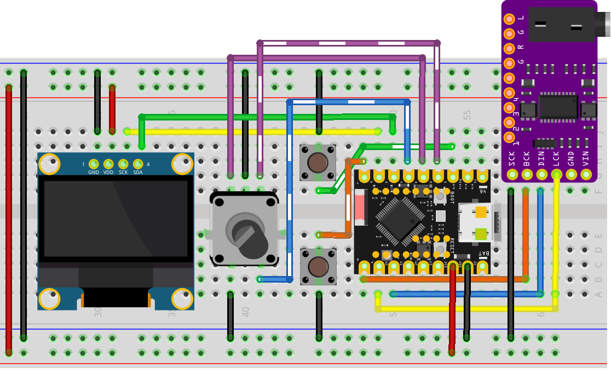

# DSP Audio Player

Este projeto foi desenvolvido para a disciplina de **Processamento Digital de Sinais (PDS)**.
Trata-se de um reprodutor e modulador de áudio digital utilizando o microcontrolador ESP32-S3,
com foco em processamento assíncrono e saída de alta fidelidade via I2S.

## Hardware e Montagem

O sistema utiliza uma arquitetura baseada em DMA para garantir que o fluxo de áudio não seja interrompido pelo processamento da interface gráfica ou leitura de sensores.

### Componentes Principais
* **MCU:** ESP32-S3 (4MB Flash)
* **DAC:** PCM5102A (Interface I2S)
* **Display:** OLED SH1106 1.3" (Interface I2C)
* **Controles:** 
    * 1 Encoder Rotativo com Push Button (Pause/Volume)
    * 2 Push Buttons (Next/Previous)

### Diagrama de Conexão



## Arquitetura e Processamento de Áudio

O núcleo deste projeto é o framework **Embassy**, que fornece um executor assíncrono leve e determinístico para sistemas embarcados, baseado em `async/await`.  
Essa abordagem elimina a necessidade de um RTOS preemptivo tradicional e permite estruturar o firmware em tarefas cooperativas bem definidas, 
com controle explícito dos pontos de espera.  
Para aplicações de Processamento Digital de Sinais (PDS), isso é especialmente relevante, pois garante previsibilidade temporal, 
baixa latência e melhor aproveitamento dos recursos do microcontrolador.

### Concorrência Assíncrona Cooperativa

O coração deste projeto é a utilização do framework **Embassy**, que permite uma execução assíncrona (`async/await`).
Isso é fundamental para um projeto de PDS, onde a precisão do timing do sinal é crítica.

O sistema é organizado nas seguintes tasks:

#### Audio Task (I2S + DMA)

Responsável por alimentar continuamente o DAC PCM5102A via I2S utilizando DMA.  

Como a transmissão ocorre por DMA, a CPU não precisa mover amostras manualmente, permanecendo livre
enquanto o periférico realiza o envio dos dados.  

#### Display Task (I2C)

Atualiza o display OLED SH1106 via I2C.  

Por ser executada de forma assíncrona, a renderização da interface não bloqueia o fluxo de áudio,
evitando *stuttering* ou interferência temporal na transmissão I2S.

#### Input Tasks (Buttons + Encoder)

As entradas **não utilizam interrupções diretas de hardware**.  

Em vez disso, o projeto utiliza `Signal` do Embassy para comunicação entre tasks.  
Cada botão ou evento do encoder publica sinais que são consumidos por tasks responsáveis pelo processamento da ação correspondente.

O fluxo funciona assim:

1. `button_task` detecta o evento físico.
2. Um `Signal` é acionado.
3. A task consumidora acorda e processa a ação (Play/Pause, Next, Previous).
4. O sistema de áudio e display reagem ao novo estado.

O controle de volume é tratado de forma semelhante, onde o `encoder_reader_task` publica eventos consumidos pela `volume_handler_task`.

### Orquestração das Tasks

O sistema é inicializado com o `Spawner` do Embassy, que organiza todas as tasks cooperativas:

- `button_task` → Play/Pause, Previous, Next  
- `encoder_reader_task` → leitura do encoder  
- `volume_handler_task` → atualização de volume  
- `display_task` → interface gráfica  
- `audio_task` → streaming I2S  

Essa divisão mantém responsabilidades bem isoladas e facilita manutenção e expansão futura do projeto.


### Conversão de Áudio (PDS)

Para a disciplina de PDS, o foco é a modulação e o streaming de dados. 
Os arquivos de áudio devem ser convertidos para o formato raw (PCM 16-bit) antes de serem embarcados ou lidos pelo sistema.

Comando FFmpeg utilizado:
```bash
ffmpeg -i music.mp3 -ar 11025 -ac 1 -f s16le music.raw
```
